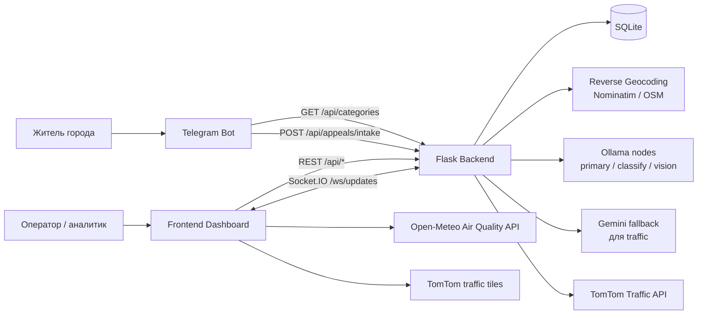
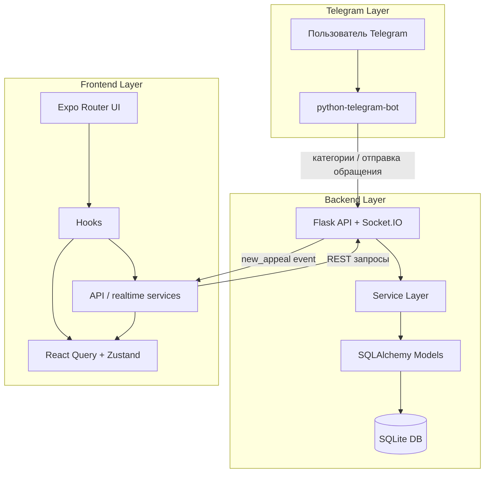
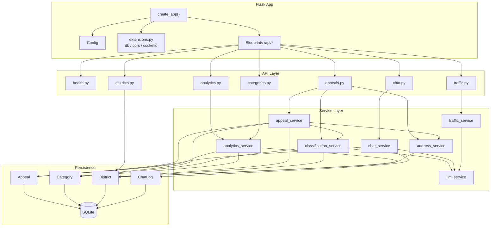
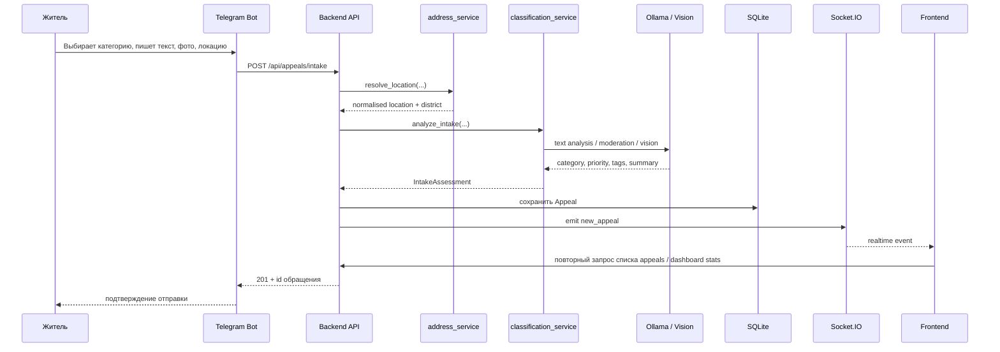
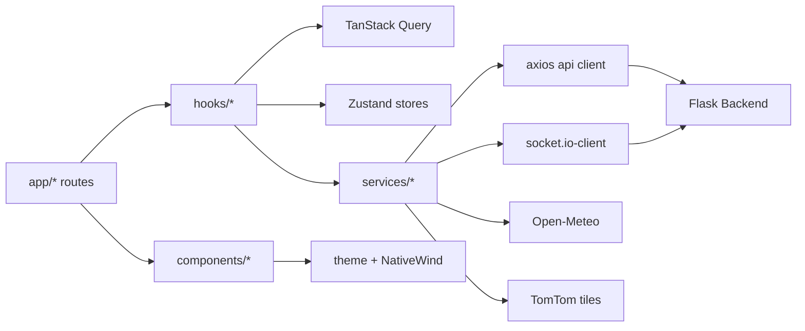
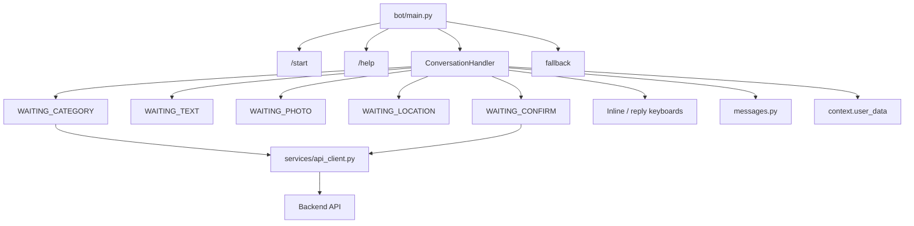
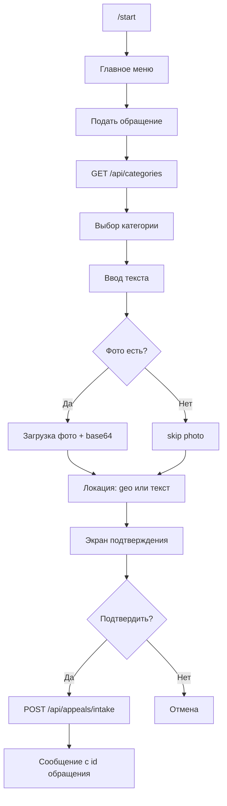
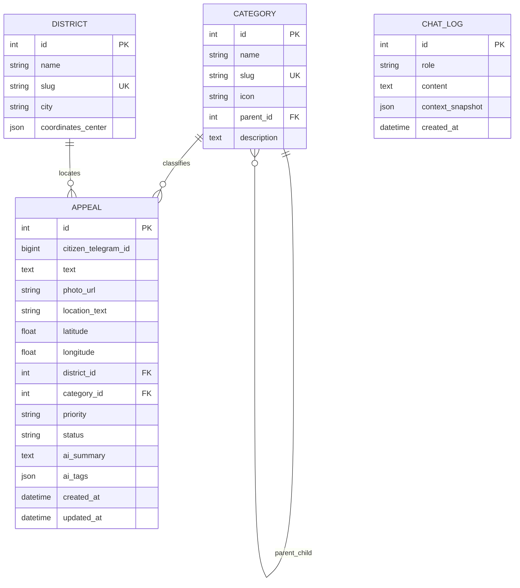
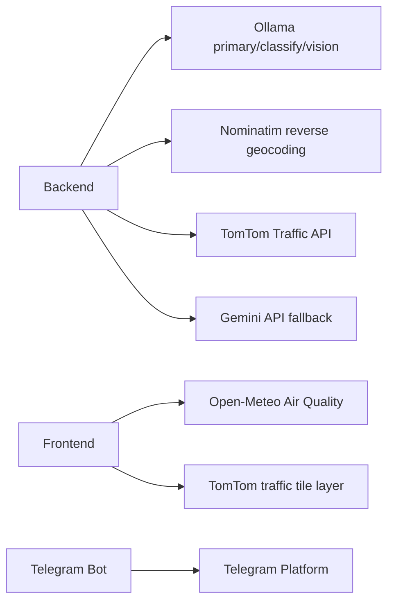

# AndATRA: визуальная архитектура проекта

Этот файл описывает полную архитектуру проекта `AndATRA` в привязке к текущему коду репозитория.
Диаграммы сделаны в `Mermaid`, поэтому их удобно смотреть прямо в Markdown-рендерах GitHub, VS Code и совместимых IDE.

## 1. Системный контекст



## 2. Главная взаимосвязь фронта, бэка и Telegram



## 3. Структура репозитория

```text
AndATRA/
|-- backend/
|   |-- app/
|   |   |-- api/
|   |   |   |-- analytics.py
|   |   |   |-- appeals.py
|   |   |   |-- categories.py
|   |   |   |-- chat.py
|   |   |   |-- districts.py
|   |   |   |-- health.py
|   |   |   `-- traffic.py
|   |   |-- data/
|   |   |   |-- mock_appeals.py
|   |   |   `-- seed.py
|   |   |-- models/
|   |   |   |-- appeal.py
|   |   |   |-- category.py
|   |   |   |-- chat_log.py
|   |   |   `-- district.py
|   |   |-- services/
|   |   |   |-- address_service.py
|   |   |   |-- analytics_service.py
|   |   |   |-- appeal_service.py
|   |   |   |-- chat_service.py
|   |   |   |-- classification_service.py
|   |   |   |-- llm_service.py
|   |   |   `-- traffic_service.py
|   |   |-- utils/
|   |   |   |-- response.py
|   |   |   `-- validators.py
|   |   |-- config.py
|   |   |-- extensions.py
|   |   `-- __init__.py
|   |-- migrations/
|   |-- tests/
|   `-- run.py
|-- frontend/
|   |-- app/
|   |   |-- index.tsx
|   |   |-- _layout.tsx
|   |   |-- air-quality/
|   |   |-- analytics/
|   |   |-- appeals/
|   |   |-- categories/
|   |   |-- chat/
|   |   |-- map/
|   |   |-- profile/
|   |   |-- reports/
|   |   `-- traffic-ai/
|   |-- components/
|   |   |-- air-quality/
|   |   |-- analytics/
|   |   |-- appeals/
|   |   |-- chat/
|   |   |-- common/
|   |   |-- dashboard/
|   |   |-- icons/
|   |   |-- layout/
|   |   |-- map/
|   |   `-- traffic-ai/
|   |-- constants/
|   |   `-- config.ts
|   |-- hooks/
|   |   |-- useAirQuality.ts
|   |   |-- useAnalytics.ts
|   |   |-- useAppeals.ts
|   |   |-- useAppTheme.ts
|   |   |-- useChat.ts
|   |   |-- useRealtime.ts
|   |   |-- useReferenceData.ts
|   |   `-- useTrafficAi.ts
|   |-- services/
|   |   |-- airQuality.ts
|   |   |-- analytics.ts
|   |   |-- api.ts
|   |   |-- appeals.ts
|   |   |-- categories.ts
|   |   |-- chat.ts
|   |   |-- clientActions.ts
|   |   |-- districts.ts
|   |   |-- realtime.ts
|   |   `-- trafficAi.ts
|   |-- stores/
|   |-- theme/
|   |-- types/
|   `-- package.json
`-- telegram/
    |-- bot/
    |   |-- handlers/
    |   |   |-- appeal.py
    |   |   |-- fallback.py
    |   |   |-- help.py
    |   |   `-- start.py
    |   |-- keyboards/
    |   |   |-- categories.py
    |   |   |-- location.py
    |   |   `-- main_menu.py
    |   |-- services/
    |   |   `-- api_client.py
    |   |-- config.py
    |   |-- main.py
    |   |-- messages.py
    |   `-- states.py
    `-- tests/
```

## 4. Архитектура backend



## 5. Жизненный цикл обращения из Telegram



## 6. Внутренний поток frontend



### Основные экраны frontend

| Экран | Назначение | Основные источники данных |
| --- | --- | --- |
| `/` | оперативный дашборд | `/api/analytics/dashboard`, `/api/analytics/categories`, `/api/appeals` |
| `/appeals` | список и фильтрация обращений | `/api/appeals`, `/api/appeals/:id` |
| `/analytics` | сводка, тренды, heatmap | `/api/analytics/summary`, `/api/analytics/trends`, `/api/analytics/categories`, `/api/analytics/heatmap` |
| `/map` | карта районов и концентрации проблем | `/api/analytics/heatmap`, `/api/districts` |
| `/chat` | AI-чат для операторов | `POST /api/chat` |
| `/traffic-ai` | AI-анализ трафика | `GET /api/traffic/analyze`, `POST /api/traffic/chat` |
| `/air-quality` | качество воздуха | прямые запросы к Open-Meteo |
| `/categories` | каталог категорий | `/api/categories` |
| `/reports` | выгрузки и отчёты | frontend-side export + AI chat attachments |

## 7. Архитектура Telegram-бота



### Telegram conversation flow



## 8. Модель данных backend



## 9. API-поверхность и потребители

| Endpoint | Кто использует | Зачем |
| --- | --- | --- |
| `GET /api/health` | Telegram, ручная проверка | health-check сервиса |
| `GET /api/categories` | Telegram, frontend | категории обращений |
| `GET /api/districts` | frontend | справочник районов |
| `POST /api/appeals/intake` | Telegram | создание обращения от жителя |
| `GET /api/appeals` | frontend | список обращений |
| `GET /api/appeals/<id>` | frontend | карточка обращения |
| `GET /api/analytics/dashboard` | frontend | KPI для главного экрана |
| `GET /api/analytics/summary` | frontend | аналитическая сводка |
| `GET /api/analytics/trends` | frontend | динамика по дням |
| `GET /api/analytics/categories` | frontend | разбивка по категориям |
| `GET /api/analytics/heatmap` | frontend | концентрация по районам |
| `POST /api/chat` | frontend | AI-чат по обращениям |
| `GET /api/traffic/analyze` | frontend | AI-рекомендации по трафику |
| `POST /api/traffic/chat` | frontend | traffic-specific AI chat |
| `Socket.IO new_appeal` | frontend | realtime-обновление списка обращений и KPI |

## 10. Внешние интеграции



## 11. Технические роли модулей

### Backend

- `app/__init__.py` поднимает Flask app, подключает `db`, `cors`, `socketio`, регистрирует blueprints, создаёт таблицы и автосидит справочники.
- `app/api/*` содержит HTTP-слой и делегирует бизнес-логику в `services`.
- `app/services/appeal_service.py` является ядром intake-flow: создаёт обращение, вызывает определение адреса, AI-анализ и шлёт realtime-событие.
- `app/services/classification_service.py` отвечает за модерацию, приоритизацию, автокатегоризацию, vision-анализ фото и AI summary.
- `app/services/address_service.py` нормализует адрес, делает reverse geocoding и матчинг района.
- `app/services/chat_service.py` строит LLM-контекст из БД и сохраняет историю чата в `chat_logs`.
- `app/services/analytics_service.py` агрегирует обращения в dashboard, summary, trends, category breakdown и heatmap.
- `app/services/traffic_service.py` получает traffic data, анализирует их через LLM или deterministic fallback.
- `app/services/llm_service.py` маршрутизирует вызовы в Ollama, поддерживает mock mode и fallback между нодами.

### Frontend

- `app/_layout.tsx` поднимает `QueryClientProvider`, realtime bridge, тему и общий `AppShell`.
- `hooks/*` инкапсулируют загрузку данных и бизнес-сценарии UI.
- `services/api.ts` создаёт общий `axios`-клиент к backend.
- `services/realtime.ts` создаёт singleton Socket.IO client.
- `stores/*` держат локальное состояние интерфейса, чата, уведомлений и traffic AI.
- `components/*` разбиты по доменам экранов, а не в одну общую папку.

### Telegram

- `bot/main.py` запускает polling и регистрирует handlers.
- `bot/handlers/appeal.py` реализует пошаговый intake-процесс.
- `bot/services/api_client.py` делает асинхронные вызовы к backend с `X-Bot-Secret`.
- `bot/keyboards/*` формируют inline/reply-кнопки для категорий, меню и геолокации.

## 12. Ключевая архитектурная идея проекта

`AndATRA` построен как hub-and-spoke система:

1. `Telegram` является citizen-facing каналом сбора данных.
2. `Backend` является единым центром бизнес-логики, AI-обработки, хранения, аналитики и realtime-синхронизации.
3. `Frontend` является operator-facing интерфейсом поверх backend API и websocket-событий.

Иными словами:

- Telegram ничего не знает про аналитику и не хранит бизнес-логику.
- Frontend ничего не знает про модерацию и классификацию, он только отображает данные и отправляет запросы.
- Backend связывает всё вместе: intake, enrichment, storage, AI, analytics, realtime.

