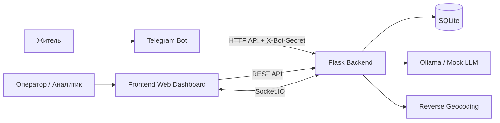
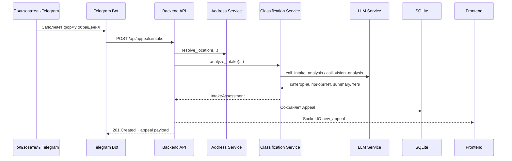

# AndATRA Project Walkthrough

Этот документ описывает полную структуру проекта `AndATRA`, архитектуру системы и взаимодействие между `frontend`, `backend` и `telegram`.

## 1. Что это за проект

`AndATRA` это full-stack платформа для приёма и обработки городских обращений.

В системе есть три основных runtime-части:

- `telegram` принимает обращения от жителей
- `backend` хранит данные, валидирует и обогащает обращения, строит аналитику и обслуживает AI-чат
- `frontend` показывает операторскую панель, список обращений, аналитику, карту и чат

Архитектурно `backend` является центральным узлом системы. И `telegram`, и `frontend` работают через него.

## 2. Общая схема взаимодействия



## 3. Системная роль каждого слоя

### `telegram`

`telegram` это thin client для intake-flow. Бот:

- показывает меню и помогает пользователю пройти сценарий подачи обращения
- запрашивает категории у backend
- собирает текст, фото и локацию
- отправляет итоговые данные в backend
- не хранит бизнес-логику аналитики у себя

### `backend`

`backend` это главный orchestration layer. Он:

- поднимает Flask API
- создаёт и поддерживает схему базы
- автоматически сидит справочные данные
- принимает обращения от Telegram-бота
- обогащает обращения через геокодинг и AI-классификацию
- хранит обращения, категории, районы и chat logs
- рассчитывает аналитику
- отдаёт данные frontend
- отправляет realtime-события через Socket.IO

### `frontend`

`frontend` это операторский web-dashboard на Expo Router / React Native Web. Он:

- читает данные из backend по REST
- держит кеш запросов через TanStack Query
- слушает realtime-события через Socket.IO
- отображает dashboard, appeals, analytics, map, air quality и AI-chat

## 4. Верхнеуровневая структура репозитория

```text
AndATRA/
|-- backend/
|   |-- app/
|   |   |-- api/
|   |   |-- data/
|   |   |-- models/
|   |   |-- services/
|   |   `-- utils/
|   |-- migrations/
|   |-- tests/
|   |-- run.py
|   |-- .env
|   |-- .env.example
|   `-- requirements.txt
|
|-- telegram/
|   |-- bot/
|   |   |-- handlers/
|   |   |-- keyboards/
|   |   |-- services/
|   |   |-- main.py
|   |   |-- config.py
|   |   |-- messages.py
|   |   `-- states.py
|   |-- tests/
|   |-- .env
|   |-- .env.example
|   `-- requirements.txt
|
|-- frontend/
|   |-- app/
|   |-- components/
|   |-- hooks/
|   |-- services/
|   |-- stores/
|   |-- constants/
|   |-- types/
|   |-- .env
|   |-- .env.example
|   `-- package.json
|
|-- README.md
|-- RUN_GUIDE.md
|-- PROJECT_DESCRIPTION.txt
`-- PROJECT_WALKTHROUGH.md
```

## 5. Backend walkthrough

### 5.1 Точка входа

Основной entrypoint backend:

- `backend/run.py`

Что происходит:

1. Вызывается `create_app()` из `app.__init__`
2. Создаётся Flask app
3. Инициализируются `db`, `cors`, `socketio`
4. Регистрируются blueprints API
5. Регистрируются Socket.IO events
6. Загружаются модели
7. Выполняется `db.create_all()`
8. Применяются runtime-fixes схемы
9. При необходимости автоматически сидятся категории и районы

### 5.2 Backend configuration

Файл:

- `backend/app/config.py`

Основные группы настроек:

- Flask и приложение: `FLASK_SECRET_KEY`, `APP_HOST`, `APP_PORT`, `FLASK_DEBUG`
- база данных: `DATABASE_URL`
- CORS и Socket.IO: `CORS_ORIGINS`, `SOCKETIO_ASYNC_MODE`
- LLM: `LLM_PRIMARY_URL`, `LLM_CLASSIFY_URL`, `LLM_VISION_URL`, модели и таймауты
- mock mode: `LLM_MOCK_MODE`
- geocoding: `GEOCODING_ENABLED`, `GEOCODING_REVERSE_URL`
- секрет для Telegram: `TELEGRAM_BOT_SECRET`

### 5.3 Backend modules

#### `app/api/`

Здесь находятся HTTP endpoints:

- `health.py` - health check
- `appeals.py` - intake и чтение обращений
- `analytics.py` - dashboard, summary, trends, heatmap, category metrics
- `chat.py` - AI-chat для операторов
- `categories.py` - список категорий для frontend и telegram
- `districts.py` - справочник районов

#### `app/models/`

Здесь находятся основные сущности базы:

- `appeal.py`
- `category.py`
- `district.py`
- `chat_log.py`

#### `app/services/`

Здесь находится вся бизнес-логика:

- `appeal_service.py` - создание и фильтрация обращений
- `classification_service.py` - AI moderation и AI classification
- `analytics_service.py` - расчёт всех аналитических данных
- `chat_service.py` - AI-chat поверх данных БД
- `llm_service.py` - маршрутизация вызовов в Ollama и mock mode
- `address_service.py` - нормализация адреса, reverse geocoding, поиск района

#### `app/data/`

Справочные и seed-данные:

- категории
- районы
- mock appeals

#### `app/utils/`

Технические вспомогательные вещи:

- API response envelope
- validators
- bot secret validation

### 5.4 Backend data model

#### `Appeal`

Главная сущность проекта. Хранит:

- текст обращения
- фото
- адрес или локацию
- `district_id`
- `category_id`
- `priority`
- `status`
- `ai_summary`
- `ai_tags`
- `created_at`, `updated_at`

#### `Category`

Справочник категорий с поддержкой иерархии:

- `name`
- `slug`
- `icon`
- `description`
- `parent_id`

#### `District`

Справочник районов:

- `name`
- `slug`
- `city`
- `coordinates_center`

#### `ChatLog`

История AI-чата:

- роль сообщения
- текст
- snapshot контекста
- timestamp

### 5.5 Основные backend endpoints

```text
GET    /api/health
POST   /api/appeals/intake
GET    /api/appeals
GET    /api/appeals/<id>
GET    /api/analytics/dashboard
GET    /api/analytics/summary
GET    /api/analytics/trends
GET    /api/analytics/categories
GET    /api/analytics/heatmap
GET    /api/categories
GET    /api/districts
POST   /api/chat
WS     /ws/updates
```

### 5.6 Как backend обрабатывает новое обращение

Основной поток создания обращения выглядит так:



Детальный runtime-path:

1. `telegram` вызывает `POST /api/appeals/intake`
2. endpoint валидирует обязательные поля
3. проверяется `X-Bot-Secret`
4. `appeal_service.create_appeal()` ищет категорию
5. `address_service.resolve_location()` нормализует location text и район
6. `classification_service.analyze_intake()` запускает AI-модерацию и классификацию
7. если есть фото, может запускаться multimodal vision analysis
8. backend формирует `Appeal`
9. AI assessment применяется к модели
10. запись коммитится в SQLite
11. backend эмитит `new_appeal` в namespace `/ws/updates`
12. frontend инвалидирует кеш обращений и dashboard

### 5.7 AI-пайплайн backend

AI в проекте разделён на несколько задач:

- intake analysis для новых обращений
- classify/fallback routing
- vision analysis для фото
- general chat для сотрудников

Файл-центр логики:

- `backend/app/services/llm_service.py`

Режимы работы:

- `LLM_MOCK_MODE=true` - backend возвращает canned responses
- real mode - backend обращается к Ollama nodes

Слои AI:

- `call_primary()` - общий AI-чат
- `call_classify()` - classification node с fallback на primary
- `call_intake_analysis()` - intake analysis для обращения
- `call_vision_analysis()` - анализ фото

### 5.8 Геообогащение

Файл:

- `backend/app/services/address_service.py`

Что делает:

- нормализует вручную введённый адрес
- пытается определить район по тексту
- при наличии координат вызывает reverse geocoding
- объединяет ручной адрес и геокодинг
- если точного района нет, выбирает ближайший район по `coordinates_center`

### 5.9 Аналитический слой

Файл:

- `backend/app/services/analytics_service.py`

Что считает:

- dashboard counters
- summary по периоду
- narrative и highlights
- category breakdown
- trends по дням
- heatmap по районам
- resolution rate
- average response time

Важно: аналитика строится кодом backend, а не отдельной summary-model.

## 6. Telegram walkthrough

### 6.1 Точка входа

Главный файл:

- `telegram/bot/main.py`

Он:

- поднимает `ApplicationBuilder`
- регистрирует `/start`
- регистрирует `/help`
- подключает conversation handler подачи обращения
- включает polling через `run_polling()`

### 6.2 Telegram structure

```text
telegram/bot/
|-- main.py
|-- config.py
|-- messages.py
|-- states.py
|-- handlers/
|   |-- start.py
|   |-- help.py
|   |-- appeal.py
|   `-- fallback.py
|-- keyboards/
|   |-- main_menu.py
|   |-- categories.py
|   `-- location.py
`-- services/
    `-- api_client.py
```

### 6.3 Роль модулей Telegram

#### `handlers/`

- `start.py` - приветствие и главное меню
- `help.py` - инструкция пользователю
- `appeal.py` - основной multi-step intake flow
- `fallback.py` - ответ на неподдерживаемый ввод

#### `keyboards/`

- `main_menu.py` - основное меню
- `categories.py` - inline-выбор категорий и кнопки подтверждения
- `location.py` - отправка геолокации

#### `services/api_client.py`

Интеграция с backend:

- `get_categories()`
- `submit_appeal()`
- `health_check()`

### 6.4 Пошаговый сценарий бота

Сценарий из `telegram/bot/handlers/appeal.py`:

1. Пользователь нажимает кнопку подачи обращения
2. Бот запрашивает категории у backend
3. Пользователь выбирает категорию
4. Бот просит текст проблемы
5. Пользователь отправляет текст
6. Бот просит фото или `/skip`
7. Пользователь отправляет фото или пропускает шаг
8. Бот просит геолокацию, адрес или `/skip`
9. Бот показывает summary и ждёт подтверждения
10. После подтверждения бот вызывает backend API

### 6.5 Какие данные Telegram отправляет в backend

Бот формирует payload со следующими полями:

- `telegram_id`
- `text`
- `category_slug`
- `photo_url`
- `photo_base64`
- `latitude`
- `longitude`
- `location_text`

Для аутентификации используется header:

- `X-Bot-Secret`

Значение header берётся из `telegram/.env` и должно совпадать с `backend/.env`.

### 6.6 Почему Telegram считается thin layer

Бот не решает, какая категория окончательная, какой приоритет у обращения и в какой район оно попадёт. Он только:

- собирает входные данные
- валидирует UX-уровень
- передаёт данные в backend

Все важные доменные решения происходят на backend.

## 7. Frontend walkthrough

### 7.1 Точка входа

Главный файл:

- `frontend/app/_layout.tsx`

Он настраивает:

- `QueryClientProvider`
- `SafeAreaProvider`
- `GestureHandlerRootView`
- `AppShell`
- `StatusBar`
- `RealtimeBridge`

`RealtimeBridge` вызывает `useRealtime()` и подключает web-dashboard к Socket.IO.

### 7.2 Frontend structure

```text
frontend/
|-- app/
|   |-- _layout.tsx
|   |-- index.tsx
|   |-- appeals/
|   |   |-- index.tsx
|   |   `-- [id].tsx
|   |-- analytics/
|   |   |-- index.tsx
|   |   `-- trends.tsx
|   |-- categories/
|   |   `-- index.tsx
|   |-- chat/
|   |   `-- index.tsx
|   |-- map/
|   |   `-- index.tsx
|   |-- air-quality/
|   |   `-- index.tsx
|   `-- reports/
|       `-- index.tsx
|
|-- components/
|   |-- layout/
|   |-- dashboard/
|   |-- appeals/
|   |-- analytics/
|   |-- map/
|   |-- chat/
|   |-- air-quality/
|   `-- common/
|
|-- hooks/
|-- services/
|-- stores/
|-- constants/
`-- types/
```

### 7.3 Роль frontend слоёв

#### `app/`

Это route layer. Каждый файл в `app/` соответствует экрану.

Основные страницы:

- `/` - dashboard
- `/appeals` - список обращений
- `/appeals/[id]` - детали обращения
- `/analytics` - аналитический overview
- `/analytics/trends` - графики по трендам
- `/categories` - категория/справочные метрики
- `/map` - карта
- `/air-quality` - качество воздуха
- `/chat` - AI-чат
- `/reports` - экран отчётов

#### `components/`

UI-компоненты сгруппированы по доменам:

- `dashboard/` - KPI, alert banner, recent appeals
- `appeals/` - карточки, фильтры, детальный просмотр, badges
- `analytics/` - charts, summary blocks, heatmap card
- `map/` - карта города
- `chat/` - окно чата, input, сообщения
- `layout/` - shell, header, sidebar
- `common/` - loader, error state, page header, select, toast

#### `services/`

API access layer:

- `api.ts` - общий axios client
- `appeals.ts` - запросы по обращениям
- `analytics.ts` - запросы аналитики
- `chat.ts` - AI-chat
- `categories.ts` - категории
- `districts.ts` - районы
- `realtime.ts` - Socket.IO client

#### `hooks/`

React Query и orchestration hooks:

- `useAppeals.ts`
- `useAnalytics.ts`
- `useChat.ts`
- `useReferenceData.ts`
- `useRealtime.ts`

#### `stores/`

Zustand stores для клиентского состояния:

- `chatStore.ts`
- `uiStore.ts`
- `feedbackStore.ts`

### 7.4 Как frontend получает данные

Поток очень прямой:

1. UI вызывает hook
2. hook вызывает service
3. service вызывает backend API
4. ответ маппится из backend-shape в frontend-shape
5. React Query кладёт данные в кеш
6. компоненты рендерят состояние

Пример:

```text
Page -> useAppeals() -> services/appeals.ts -> GET /api/appeals -> mapAppeal() -> UI
```

### 7.5 Realtime-сценарий

Файлы:

- `frontend/services/realtime.ts`
- `frontend/hooks/useRealtime.ts`

Как это работает:

1. При загрузке layout вызывается `useRealtime()`
2. Создаётся Socket.IO client
3. клиент подключается к backend
4. слушается событие `new_appeal`
5. при событии инвалидируются query keys:
   - `["appeals"]`
   - `["dashboard-stats"]`
6. список обращений и dashboard автоматически подтягивают свежие данные

### 7.6 AI-chat на frontend

Файлы:

- `frontend/hooks/useChat.ts`
- `frontend/services/chat.ts`
- `frontend/stores/chatStore.ts`

Поток:

1. пользователь пишет сообщение
2. сообщение добавляется в Zustand store как `user`
3. frontend вызывает `POST /api/chat`
4. backend возвращает ответ ассистента
5. ответ добавляется в store
6. UI отображает переписку и вложения отчётов, если они есть

## 8. Как именно взаимодействуют frontend, backend и telegram

### 8.1 Telegram -> Backend

Это citizen intake path.

Telegram использует backend для:

- загрузки категорий
- health check
- отправки обращения

Протокол:

- HTTP REST
- JSON body
- `X-Bot-Secret` для авторизации intake

### 8.2 Frontend -> Backend

Это operator dashboard path.

Frontend использует backend для:

- чтения appeals list и appeal detail
- загрузки dashboard metrics
- получения summary/trends/heatmap/category metrics
- чтения районов и категорий
- AI-chat

Протокол:

- HTTP REST
- JSON responses в envelope-формате:

```json
{
  "success": true,
  "data": {},
  "error": null
}
```

### 8.3 Backend -> Frontend

Это realtime path.

Backend использует Socket.IO для:

- нотификации о новых обращениях

Событие:

- `new_appeal`

Namespace:

- `/ws/updates`

### 8.4 Почему frontend и telegram не общаются напрямую

В проекте нет прямой связи `frontend <-> telegram`, потому что:

- Telegram работает как канал подачи обращения
- Frontend работает как операторский интерфейс
- единый источник истины это backend + database

Это правильное архитектурное разделение, потому что:

- логика не дублируется
- данные централизованы
- AI и аналитика сосредоточены в одном месте
- frontend и telegram можно развивать независимо

## 9. End-to-end сценарии

### 9.1 Сценарий подачи обращения жителем

```mermaid
flowchart TD
    A[Житель открывает Telegram] --> B[/start]
    B --> C[Выбор категории]
    C --> D[Ввод текста]
    D --> E[Фото или skip]
    E --> F[Локация или адрес]
    F --> G[Подтверждение]
    G --> H[Telegram -> Backend intake]
    H --> I[Geo enrichment]
    I --> J[AI moderation/classification]
    J --> K[Save Appeal in DB]
    K --> L[Emit new_appeal]
    L --> M[Frontend refresh]
```

### 9.2 Сценарий работы оператора во frontend

1. Оператор открывает dashboard
2. Frontend запрашивает dashboard stats и список обращений
3. Backend считает метрики по БД
4. UI показывает KPI, breakdown и последние обращения
5. Если в Telegram приходит новый кейс, frontend получает realtime event
6. React Query инвалидирует кеш
7. UI подгружает новые данные без ручного refresh

### 9.3 Сценарий AI-чата

1. Оператор открывает экран чата
2. Пишет вопрос по обращениям, районам или статистике
3. Frontend вызывает `POST /api/chat`
4. Backend строит контекст из БД
5. `chat_service` отправляет prompt в primary LLM
6. ответ возвращается во frontend
7. при запросе сводки backend может сформировать вложения `TXT/PDF`

## 10. Runtime dependencies и внешние системы

### Обязательные

- Python
- Flask
- SQLite
- Node.js / npm
- Expo / React Native Web
- Telegram Bot API

### Опциональные, но важные

- Ollama nodes
- reverse geocoding endpoint

### Режимы AI

#### Mock mode

Используется для локальной разработки без реального AI.

Плюсы:

- быстрый запуск
- нет зависимости от LAN-ноды
- воспроизводимое поведение

#### Real LLM mode

Используется для демонстрации полной AI-архитектуры:

- primary node
- classify node
- vision node
- fallback-routing между ними

## 11. Где что менять в проекте

### Если нужно изменить сценарий подачи обращения

Смотрите:

- `telegram/bot/handlers/appeal.py`
- `telegram/bot/messages.py`
- `backend/app/api/appeals.py`
- `backend/app/services/appeal_service.py`
- `backend/app/services/classification_service.py`

### Если нужно изменить аналитику

Смотрите:

- `backend/app/services/analytics_service.py`
- `frontend/services/analytics.ts`
- `frontend/hooks/useAnalytics.ts`
- `frontend/components/analytics/`
- `frontend/components/dashboard/`

### Если нужно изменить AI-чат

Смотрите:

- `backend/app/api/chat.py`
- `backend/app/services/chat_service.py`
- `backend/app/services/llm_service.py`
- `frontend/services/chat.ts`
- `frontend/hooks/useChat.ts`
- `frontend/components/chat/`

### Если нужно изменить realtime

Смотрите:

- `backend/app/services/appeal_service.py`
- `backend/app/api/__init__.py`
- `frontend/services/realtime.ts`
- `frontend/hooks/useRealtime.ts`

## 12. Архитектурные сильные стороны проекта

- Чёткое разделение на intake layer, orchestration layer и dashboard layer
- Backend является единым источником истины
- AI и аналитика централизованы
- Frontend не зависит от Telegram-specific логики
- Telegram не содержит тяжёлой domain logic
- Есть mock mode для локальной разработки
- Есть realtime-механизм для обновления операторской панели
- Архитектура уже близка к production-style MVP

## 13. Краткий итог

`AndATRA` построен как трёхзвенная система:

- `telegram` собирает обращения
- `backend` принимает решения, хранит данные и обслуживает API
- `frontend` показывает операторам актуальную картину и инструменты анализа

Если коротко, поток данных в проекте выглядит так:

```text
Citizen -> Telegram -> Backend -> Database -> Frontend
                           -> AI
                           -> Realtime
```

Это делает проект цельным full-stack MVP с реальным пользовательским вводом, обогащением данных, аналитикой, картой, AI и live-обновлениями.
