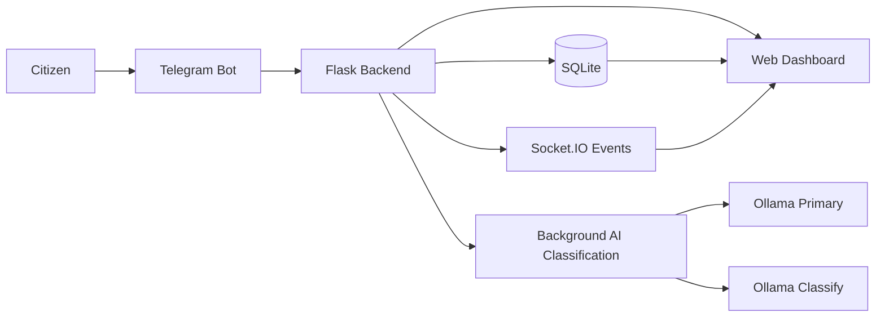

# AndATRA

AI-assisted municipal issue intake and urban analytics platform built for city operations teams.

AndATRA combines three interfaces into one operational workflow:

- a Telegram bot for citizen issue submission
- a Flask backend for storage, orchestration, analytics, and AI processing
- a React Native Web dashboard for operators, analysts, and decision-makers

The project is designed as a practical MVP for a modern city service desk: citizens report problems through a familiar channel, the platform structures and enriches those reports, and city staff work with a live dashboard, district-level analytics, and an AI assistant.

## Why This Project Matters

Municipal issue handling often breaks down between intake, prioritization, and visibility. AndATRA was built to close that gap with:

- low-friction citizen reporting through Telegram
- centralized backend-driven data flow
- AI-assisted classification
- real-time updates for the operations dashboard
- analytics views for trends, hotspots, and response patterns

## Core Capabilities

- Multi-step Telegram intake flow with category selection, text, optional photo, and optional location
- Backend API for appeals, categories, districts, analytics, and AI chat
- Automatic background classification of new appeals after submission
- Real-time event delivery with Socket.IO when new appeals are created
- Operations dashboard with KPIs, recent appeals, category breakdown, and export actions
- Appeals workspace with filtering, pagination, CSV export, and detailed drill-down
- Analytics overview with computed narrative summaries, heatmap insights, and category trends
- Map view for district-level issue concentration
- AI chat interface for querying the operational dataset in natural language
- Mock LLM mode for development without Ollama or GPU access
- Dual-node Ollama support for LAN-based model routing

## Product Walkthrough



### End-to-end flow

1. A citizen submits an issue through the Telegram bot.
2. The backend stores the appeal and immediately emits a real-time event.
3. A background worker classifies the appeal, assigns priority, extracts tags, and builds a short case summary.
4. The dashboard updates through API reads plus websocket events.
5. City staff review KPIs, appeal details, district hotspots, and computed analytics insights.

## Architecture

### Frontend

- Expo Router + React Native Web
- TanStack Query for server state
- Zustand for local UI/chat state
- Leaflet for district-level mapping
- Socket.IO client for real-time updates

### Backend

- Flask application factory
- Flask-SocketIO for live updates
- SQLAlchemy + SQLite for persistence
- Alembic for schema migrations
- Service-layer architecture for appeals, analytics, chat, and LLM routing

### Telegram bot

- `python-telegram-bot`
- thin data-collection layer with minimal business logic
- authenticated communication with backend via shared secret

### AI layer

- Ollama-based model routing
- separate roles for primary chat and classification
- graceful fallback from classification to the primary node
- mock mode for local development and demos

## Tech Stack

| Layer | Stack |
| --- | --- |
| Frontend | React Native Web, Expo Router, TypeScript, NativeWind, TanStack Query, Zustand, Leaflet |
| Backend | Python, Flask, Flask-SocketIO, SQLAlchemy, Alembic |
| Bot | python-telegram-bot, aiohttp |
| Data | SQLite |
| AI | Ollama, LAN-ready dual-node model routing |
| Testing | pytest, pytest-asyncio |

## Repository Structure

```text
AndATRA/
|-- backend/      Flask API, business logic, data models, analytics, AI services
|-- frontend/     Expo Router dashboard for operations teams
|-- telegram/     Telegram bot for citizen submissions
|-- LOCAL_NETWORK_DEPLOYMENT.md
`-- README.md
```

Additional component-level docs:

- [RUN_GUIDE.md](RUN_GUIDE.md)
- [PROJECT_WALKTHROUGH.md](PROJECT_WALKTHROUGH.md)
- [backend/README.md](backend/README.md)
- [frontend/README.md](frontend/README.md)
- [telegram/README.md](telegram/README.md)
- [LOCAL_NETWORK_DEPLOYMENT.md](LOCAL_NETWORK_DEPLOYMENT.md)

## Fastest Demo Path

If you want the best portfolio demo experience with the least setup friction, start with:

- backend in mock LLM mode
- seeded local database
- frontend on web
- Telegram bot optional

This gives you a fully navigable dashboard without requiring external AI infrastructure.

## Getting Started

### Prerequisites

- Python 3.11+
- Node.js 18+
- npm
- Optional: Ollama
- Optional: Telegram bot token from `@BotFather`

### 1. Install dependencies

Commands below use PowerShell.

```powershell
python -m pip install -r backend\requirements.txt -r telegram\requirements.txt
npm --prefix frontend install
```

### 2. Create environment files

```powershell
Copy-Item backend\.env.example backend\.env
Copy-Item telegram\.env.example telegram\.env
Copy-Item frontend\.env.example frontend\.env
```

### 3. Recommended local development config

For `backend/.env`, use mock mode if you do not want to configure Ollama yet:

```env
LLM_MOCK_MODE=true
APP_HOST=0.0.0.0
APP_PORT=5000
DATABASE_URL=sqlite:///andatra.db
TELEGRAM_BOT_SECRET=shared_secret_token_here
```

For `telegram/.env`:

```env
TELEGRAM_BOT_TOKEN=your_bot_token_here
BACKEND_URL=http://localhost:5000
BOT_SECRET=shared_secret_token_here
```

For `frontend/.env`:

```env
EXPO_PUBLIC_BACKEND_URL=http://localhost:5000
EXPO_PUBLIC_APP_NAME=AndATRA
```

### 4. Initialize the database

From the backend directory:

```powershell
cd backend
alembic upgrade head
python -m app.data.seed
```

Notes:

- the backend also creates tables automatically at startup for developer convenience
- the seed script is idempotent, so it is safe to rerun

### 5. Start the backend

```powershell
cd backend
python run.py
```

Health check:

```powershell
curl http://localhost:5000/api/health
```

### 6. Start the frontend

```powershell
cd frontend
npm run web
```

### 7. Start the Telegram bot

```powershell
cd telegram
python -m bot.main
```

## Key API Surface

| Method | Endpoint | Purpose |
| --- | --- | --- |
| `GET` | `/api/health` | Service health check |
| `POST` | `/api/appeals/intake` | Receive a new appeal from Telegram |
| `GET` | `/api/appeals` | List and filter appeals |
| `GET` | `/api/appeals/<id>` | Appeal detail |
| `GET` | `/api/categories` | Appeal category tree |
| `GET` | `/api/districts` | District reference data |
| `GET` | `/api/analytics/dashboard` | KPI counters for the main dashboard |
| `GET` | `/api/analytics/summary` | Aggregated summary and computed narrative insights |
| `GET` | `/api/analytics/trends` | Time-series metrics |
| `GET` | `/api/analytics/categories` | Category breakdown |
| `GET` | `/api/analytics/heatmap` | District heatmap data |
| `POST` | `/api/chat` | AI assistant chat endpoint |

## AI Modes

### Mock mode

Use this for development, demos, and portfolio screenshots:

- no Ollama setup required
- predictable responses
- quickest way to launch the full stack locally

### Real LAN-based Ollama mode

Use this when you want the full AI architecture:

- primary model for general chat
- classification model for intake enrichment
- fallback to primary node if the classification node is unavailable

Detailed setup guide:

- [LOCAL_NETWORK_DEPLOYMENT.md](LOCAL_NETWORK_DEPLOYMENT.md)

## Testing

### Backend

```powershell
cd backend
python -m pytest
```

### Frontend type check

```powershell
cd frontend
npm run typecheck
```

### Telegram bot

```powershell
cd telegram
python -m pytest
```

## Portfolio Highlights

This project is especially strong as a portfolio piece because it demonstrates:

- full-stack system thinking across frontend, backend, bot integration, database, and AI services
- real product framing instead of a disconnected CRUD demo
- asynchronous background processing after intake
- real-time synchronization between backend and dashboard
- modular architecture with clear separation of concerns
- practical AI integration with graceful degradation and mock-friendly development
- deployment thinking beyond localhost through local network model orchestration

## Current Notes

- The current UI copy and seeded domain data are focused on Almaty.
- Parts of the interface and seeded content are currently in Russian.
- SQLite is used for the MVP and local development; PostgreSQL would be a natural production upgrade.
- The dashboard is optimized for operational review and internal usage rather than public self-service.
- Telegram polling supports only one active bot process per token at a time.

## Suggested Demo Story

For a portfolio presentation, the strongest demo sequence is:

1. Open the dashboard and show the KPI cards, recent appeals, and category breakdown.
2. Move into the appeals workspace and filter issues by priority or category.
3. Open analytics to show trends, computed narrative insights, and district heatmap signals.
4. Show the map view for spatial clustering.
5. Submit a new issue through Telegram and demonstrate the backend-to-dashboard flow.
6. Ask the AI assistant a question about critical cases or district performance.

## Future Improvements

- Replace SQLite with PostgreSQL and background jobs with a dedicated task queue
- Add authentication and role-based access control for dashboard users
- Introduce richer observability, tracing, and audit logs
- Support multilingual UI and citizen-facing localization
- Add media storage abstraction for uploaded photos
- Expand analytics toward SLA tracking and resolution workflows

## License

This repository is currently presented as a portfolio project. Add a dedicated license if you plan to distribute or open-source it publicly.
